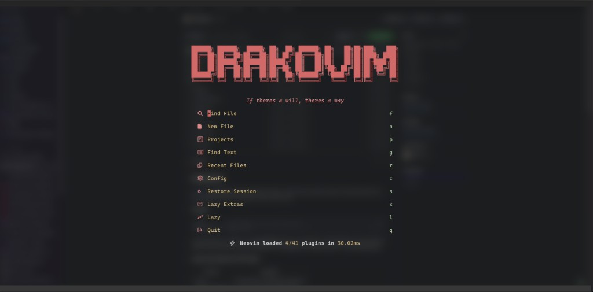
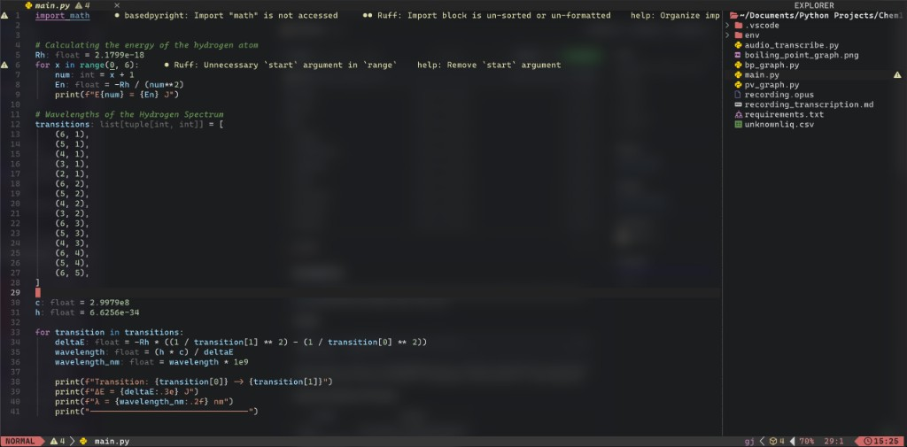
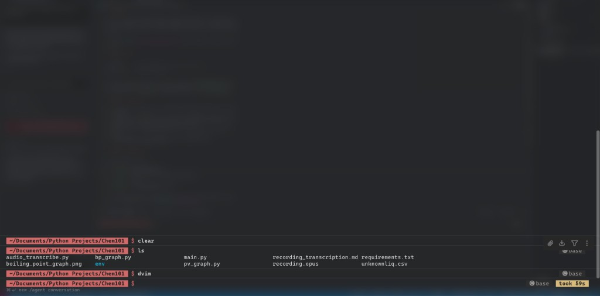

# DrakoVim

This is my personal Neovim config. I grew up on VS Code, so I built this to
feel like that, just with my own preferences mixed in. It also matches how
my zsh and Warp are set up. Editor, prompt, and terminal all share the same
look.

I use [LazyVim](https://www.lazyvim.org/) under the hood. I launch it with
`dvim`.

## How I use it

```bash
dvim            # open DrakoVim in the current directory
dvim file.py    # open a specific file
```

I have a `dvim` alias in my `~/.zshrc` that runs `NVIM_APPNAME=dvim nvim`,
so this stays out of the way of any other Neovim I have. This repo is
symlinked to `~/.config/dvim`. Plugin data lives in `~/.local/share/dvim`.

## What it looks like

The dashboard when I open `dvim` with no file:



Editing a file. Explorer on the right, red statusline, same feel as VS Code:



My Warp terminal. Same red path block, conda/venv on the right:



- VS Code Dark+ colors, with a transparent background so Warp's blur shows
  through
- My red accent (`#D16969`) on the statusline, dashboard, and folder icons
- Explorer on the right, the way I keep it in VS Code. Red folder icons,
  white-grey text, and the same git letters (M/A/U)
- Tabs on top, a VS Code-style statusline, and a transparent terminal on
  Ctrl+`
- Rotating mottos on the dashboard under the DRAKOVIM banner
- A smear cursor, because I like it

## Keys I actually use

| Key | What it does |
| --- | --- |
| `Ctrl+P` | Quick-open files |
| `Ctrl+B` | Toggle the explorer |
| `` Ctrl+` `` (or `Ctrl+/`) | Toggle the terminal |
| `Ctrl+S` | Save |
| `Space /` | Search the whole project |
| `Shift+H / L` | Switch tabs |

If I forget something, I press `Space` and wait. which-key shows the rest.
I keep a longer list in [CHEATSHEET.md](CHEATSHEET.md).

## Languages and AI

I set this up for what I actually write: Python (basedpyright + ruff),
TypeScript and JavaScript (vtsls + prettier), JSON, Markdown, Lua, and
shell. Files format on save. Servers install themselves through `:Mason`.

For AI I wanted something close to Cursor. Copilot handles the inline
suggestions (Tab to accept). avante.nvim is the sidebar. `Space a a` to
ask, `Space a e` to edit a selection. I had to run `:Copilot auth` once.

## My terminal (Warp and Starship)

I use the same colors in my terminal. Those configs live in `extras/`.

- `extras/warp/DrakoVim.yaml` is my Warp theme. Copy it to `~/.warp/themes/`
  and set `theme = "DrakoVim"` in `~/.warp/settings.toml`, or just pick it
  in Warp's theme picker.
- `extras/starship/starship.toml` is my Starship prompt. Red path block on
  the left. venv, conda, git, and command duration on the right. Copy it to
  `~/.config/starship.toml` and add `eval "$(starship init zsh)"` to
  `~/.zshrc`.

## Setting it up on a new machine

```bash
git clone https://github.com/Dichill/DrakoVim.git ~/Documents/Projects/DrakoVim
ln -s ~/Documents/Projects/DrakoVim ~/.config/dvim
echo 'alias dvim="NVIM_APPNAME=dvim nvim"' >> ~/.zshrc
dvim   # plugins install themselves on first launch
```

You'll need Neovim 0.12+, git, ripgrep, fd, and a Nerd Font. I use
CaskaydiaCove Nerd Font (Cascadia Code with icons and ligatures).

## What's in here

```
init.lua                    entry point
lua/config/lazy.lua         lazy.nvim bootstrap + plugin spec
lua/config/options.lua      editor options
lua/config/keymaps.lua      my VS Code-style keybinds
lua/config/autocmds.lua     terminal polish
lua/plugins/colorscheme.lua VS Code theme + my red accents
lua/plugins/ui.lua          explorer, tabs, statusline, dashboard mottos
lua/plugins/avante.lua      AI sidebar (Copilot-powered)
lazyvim.json                enabled LazyVim extras
extras/                     Warp theme + Starship prompt
assets/                     screenshots of the editor, dashboard, and Warp
```

## If something breaks

- `:Lazy sync` updates plugins
- `:LazyExtras` adds more language extras
- `:Mason` manages LSPs and formatters
- `:LazyHealth` tells me if something is off
